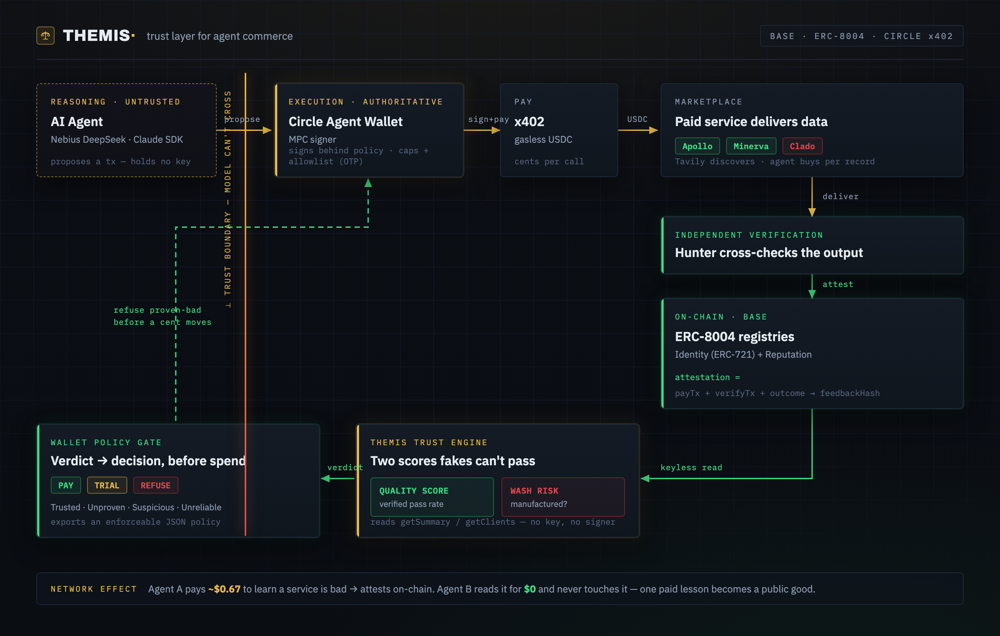

<div align="center">

# ⚖️ THEMIS

### Trust layer for agent commerce — _who your agent should pay, and who to avoid._

**[▶ Live demo →](https://themis-agent-trust.netlify.app)**  ·  Base · ERC-8004 · Circle x402

</div>

---

Billions of AI agents are about to spend real money on each other's APIs — autonomously. The
problem nobody solved: **how does an agent know which service to trust _before_ it pays?**

Star ratings are free to fake. THEMIS makes a score that isn't: **no payment + independent
verification, no reputation.** Every score is minted from a real USDC call that a second agent
cross-verified, then written to **ERC-8004 on Base** — Sybil-resistant by requiring paid
interactions, independent verification, and wash-risk analysis.

> **Reviews are claims.** THEMIS requires a paid interaction, independent verification, and an
> on-chain attestation before reputation moves.

---

## Architecture



The whole system is one **clockwise loop**:

1. **Spend path** — the AI model *proposes*; it holds no key. The **Circle Agent Wallet (MPC)**
   signs only what passes the wallet's on-chain policy, then pays a service via **x402**. A
   prompt-injected model **cannot cross the trust boundary**.
2. **Proof loop** — the paid output is **independently cross-verified** (Hunter checks Apollo);
   `payTx + verifyTx + outcome` are bound into one attestation on the **ERC-8004** registry. Identity
   is an **ERC-721**, so a track record is an ownable asset.
3. **Trust feedback** — THEMIS reads reputation **keyless** and scores it on two axes, then the
   wallet **refuses proven-bad services before a cent moves.** Agent A pays to learn; **Agent B reads
   for $0.**

## The one idea that makes it un-fakeable: two scores, not one

Saying *"payment proves quality"* is attackable — a service can pay to manufacture its own
reputation. So THEMIS never collapses trust into one number:

| | **Quality Score** | **Wash Risk** |
|---|---|---|
| Answers | Was the output good? | Was the reputation manufactured? |
| From | verified pass rate | circular payments, exclusive verifiers, buyer/verifier diversity, self-attestation |

A service with a **100% pass rate but a circular buyer→seller funding loop** is flagged
**Suspicious**, not Trusted — and the [policy engine](https://themis-agent-trust.netlify.app/policy)
turns that verdict into a `PAY / TRIAL / REFUSE` decision your wallet can enforce (exportable as JSON).

## See it in 90 seconds
| Step | Where |
|---|---|
| **Trust Explorer** — services ranked by on-chain reputation, two scores each | [`/`](https://themis-agent-trust.netlify.app) |
| **Catch a fake** — 100% quality, flagged Suspicious (wash risk 88) | [`/service/helix-signals`](https://themis-agent-trust.netlify.app/service/helix-signals) |
| **Policy engine** — pay / trial / refuse, before spend | [`/policy`](https://themis-agent-trust.netlify.app/policy) |
| **Live run** — agent refuses to pay the proven-bad service | [`/live`](https://themis-agent-trust.netlify.app/live) → **Replay** |
| **Bounties + on-chain proof** | [`/about`](https://themis-agent-trust.netlify.app/about) |

## ✅ Real on-chain (Base Sepolia — verify it yourself)
Not a mock: 3 service identities are minted as ERC-721s and 9 payment-anchored attestations are
written via keyless Circle MPC.

| Service | ERC-8004 agentId | On-chain reputation |
|---|---|---|
| Apollo People Enrich | `7100` | **100%** · 3 verified attestations |
| Minerva Enrich | `7101` | **100%** · 3 verified attestations |
| Clado Contacts Enrich | `7102` | **0%** · 3 attestations, all failed verification |

[identity NFT #7100](https://sepolia.basescan.org/token/0x8004A818BFB912233c491871b3d84c89A494BD9e?a=7100)
· [register tx](https://sepolia.basescan.org/tx/0x500e24e18bf16d401b5b4f1bcfee2e83bfa9dab7050ad968c596d645d9ff6983)
· ReputationRegistry `0x8004B663…` · IdentityRegistry `0x8004A818…`

## Run it

```bash
# The infrastructure demo (headline) — two agents + real on-chain reputation, free (no keys, no USDC)
npm run network-demo:sim

# The product frontend (THEMIS console) — reads the same on-chain data
cd web && npm run dev          # http://localhost:3000

# Reference consumer — a budget-governed lead-gen agent, 3 interchangeable drivers
npm run agent "Series A fintech CTOs in Europe, 8 leads"   # Nebius brain (free credits)
npm run consumer "..."         # deterministic fallback (reliable on stage)
```

<details>
<summary><b>Real on-chain attestations (free — Circle sponsors testnet gas)</b></summary>

```bash
# Two Base Sepolia wallets (the registry blocks self-feedback, so they MUST differ)
circle wallet login <email> --testnet
circle wallet create --testnet
circle wallet list --chain BASE-SEPOLIA      # copy both addresses into .env

# .env: SIMULATE=1  ONCHAIN_REPUTATION=1  ERC8004_NETWORK=base-sepolia
#       REGISTRAR_WALLET_ADDRESS=0x…   AGENT_WALLET_ADDRESS=0x…  (must differ)
npm run register-services                              # mint ERC-721 identities (keyless)
SIMULATE=1 ONCHAIN_REPUTATION=1 npm run network-demo   # real attestations + on-chain read-back
```

No private key is ever held by this code: the agent encodes the call, **Circle MPC signs it** behind
the wallet's policy, and **auto-deploys the SCA + sponsors gas**. Payments (`SIMULATE`) and reputation
(`ONCHAIN_REPUTATION`) are **decoupled**, so the novel on-chain layer runs real on free testnet while
payments stay simulated. Default LLM model `deepseek-ai/DeepSeek-V3.2` on Nebius (best tool-caller).
</details>

## Bounties · Agents Hackathon 2026 (42berlin)
| Track | Fit |
|---|---|
| **Circle — Agentic Commerce** ($1,000) | x402 USDC nanopayments from a keyless Circle Agent Wallet (MPC) behind an on-chain policy |
| **Agent Infrastructure — ERC-8004** | ERC-721 identities + real reputation attestations; THEMIS is the trust/monitoring layer on top |
| **Nebius TokenFactory** ($500×2) | the agent brain (DeepSeek-V3.2) — discover, decide, cross-verify |
| **Tavily** ($500) | prospect discovery — the first step of every run |
| **Blockchain for Good** ($500) | Sybil-resistant trust makes a trillion-dollar agent economy safe from wash-traded reputation |

## Repo layout
```
web/        THEMIS console (Next.js) — Trust Explorer · Policy Engine · Live Run · Feed
            lib/intel.ts   the trust engine: quality + wash-risk + verdict + policy
lib/        reputation (Proof-of-Quality attestations) · erc8004 (keyless encode + read) ·
            circle-execute (keyless MPC boundary) · rail (real|sim payment) · policy · ledger
agents/     network-demo (two agents + on-chain reputation) · leadgen-core (shared tools) ·
            leadgen-agent-nebius (default) · leadgen-agent (Claude SDK) · consumer (deterministic)
scripts/    register-services (mint ERC-721 identities) · spike-payment
vendor/     official Circle kits + real ERC-8004 ABIs
docs/       architecture.png (+ architecture.html source)
```

See **[PITCH_LIVE_DEMO.md](./PITCH_LIVE_DEMO.md)** for the demo script, **[HANDOFF.md](./HANDOFF.md)**
for full build state + gotchas, and **[web/README.md](./web/README.md)** for the frontend.

---

<div align="center"><sub>A trillion-dollar agent economy can't run on reputation you can fake. So we made reputation you can't.</sub></div>
