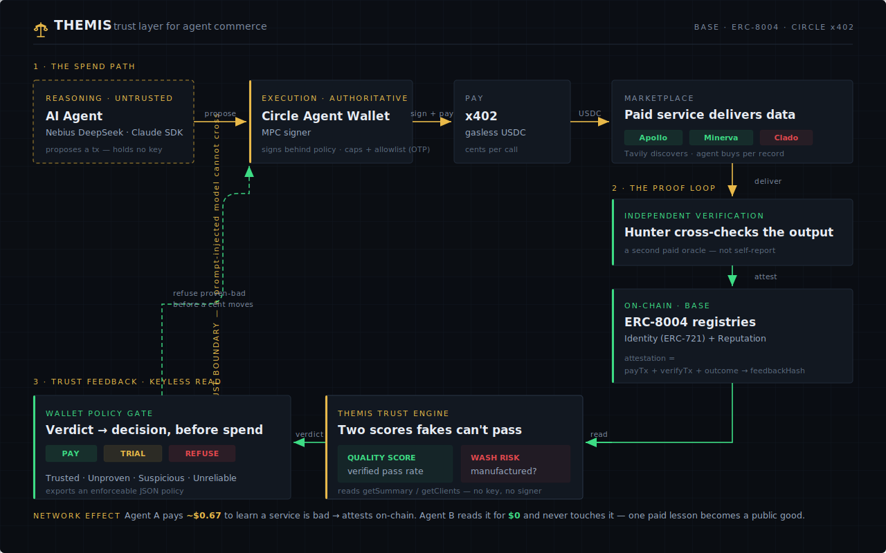

# 🛰️ AgentMarket — Proof-of-Quality: trustworthy commerce for AI agents

**The problem:** an AI agent with a wallet can pay any service on the marketplace — but it pays
**blind**. There's no trustworthy signal of whether a service's data is accurate or whether it's a
scam, and any "reputation" is gameable by Sybils. Agents have money and discovery; they're missing
a **trust layer**.

**The infrastructure (two primitives):**

1. **Payment-anchored, verification-backed reputation.** A service's reputation can only be minted
   from a **real, paid, independently cross-verified** interaction. Each attestation binds the
   **Circle payment tx** + an **independent verification tx** + the outcome, and is published to the
   **ERC-8004 ReputationRegistry** (real standard, deployed on Base). *You cannot fake a good score
   without spending real USDC and passing an independent oracle* — Sybil-resistant by construction.

2. **Keyless, policy-bound spending.** The AI model **never holds a key and never signs.** It only
   *proposes* a transaction; the **Circle Agent Wallet** (MPC) signs it behind the wallet's on-chain
   spending policy (allowlist + caps, set by the human via OTP). A **prompt-injected agent cannot
   move funds or write off-policy** — the signer refuses.

**The payoff (network effect):** Agent A pays 3 competing enrichment services, cross-verifies each,
and attests on-chain — one proves bad. An **independent Agent B queries reputation *before paying*,
and its wallet refuses the proven-bad service it never touched.** Agent A spent ~$0.67 to learn that;
because it's on-chain and verification-backed, **Agent B pays $0 to benefit.** One agent's paid lesson
becomes a public good.

```bash
npm run network-demo:sim     # watch it end-to-end, free (no keys, no USDC)
```

> **Reference consumer:** a budget-governed **B2B lead-gen agent** demonstrates the layer — it
> discovers prospects (Tavily), buys enrichment per-record via **Circle Nanopayments**, **pays Hunter
> to verify** each email, qualifies with **Nebius**, and only trusts services with proven on-chain
> reputation. Identity is an **ERC-721** (ERC-8004), so a verified track record is an ownable asset.

See **[PITCH.md](./PITCH.md)** for the demo script and **[PLAN.md](./PLAN.md)** for build notes.

## Circle Agent Stack usage (prize requirements)
| Requirement | Where |
|---|---|
| Circle **Agent Wallet** (payment identity + budget) | `lib/circle-cli.ts`, `lib/policy.ts` |
| Wallet action (create/list/balance/pay) | `circle wallet …`, `circle services pay …` wrappers |
| Circle **Agent Marketplace** (discover + inspect + price) | `searchServices` / `inspectService` |
| **Nanopayments** (gasless USDC, x402) | `payService` → `circle services pay` |
| **Circle CLI** + **Skills** | CLI wrappers; `circle skill install` in setup |
| **Starter kit** | Claude Agent SDK kit (`@anthropic-ai/claude-agent-sdk`) |
| Receipt / spend ledger | `lib/ledger.ts` → console + `ledger.json` |
| Budget / spend cap / approval / **policy-based behavior** | `lib/policy.ts` + keyless Circle signer (`lib/circle-execute.ts`) |
| "What it paid for & why" | every payment carries a `reason`; shown in ledger + dashboard |

## Infrastructure track usage (verifiable reputation + identity)
| Element | Where |
|---|---|
| **ERC-8004** Identity (ERC-721) + Reputation registries | `lib/erc8004.ts` (real ABIs vendored, deployed Base Sepolia `0x8004…`) |
| **Payment-anchored attestations** (Sybil-resistant) | `lib/reputation.ts` — binds pay tx + verify tx + outcome via `feedbackHash` |
| **Reputation gate** (route around proven-bad services) | `reputationGate()` → wallet refuses below-threshold payees |
| **Keyless signing** (model proposes, MPC signs behind policy) | `lib/circle-execute.ts` → `circle wallet execute` |
| **Verifiable logs / explorer proof** | BaseScan tx + ERC-721 identity-token links in demo output |
| **Cross-verification oracle** | one paid service independently checks another (Hunter verifies Apollo) |

## Architecture



**How the building blocks play together:**
- **Reasoning (untrusted):** the AI model reasons over tools and *proposes* transactions. It holds
  no key. `SpendPolicy` is a fast advisory check — useful, but it runs in the same process the model
  could be tricked in, so it is **not** trusted.
- **Trust boundary:** a prompt-injected model cannot cross it. Nothing the model says becomes a
  signed transaction on its own.
- **Execution (authoritative):** the **Circle Agent Wallet (MPC)** signs *only* what passes the
  wallet's on-chain spending policy — allowlist + caps the human sets via OTP. Two channels:
  **x402 pay** (buy real data) and **wallet execute** (write ERC-8004 attestations).
- **Proof-of-Quality loop:** a service is paid, then **independently cross-verified** (Hunter checks
  Apollo's email); the payment tx + verify tx + outcome are bound into one **attestation** on the
  **ERC-8004 ReputationRegistry**. Identity is an **ERC-721**, so reputation is an ownable asset.
- **Reputation gate (keyless read):** before paying, an agent reads on-chain reputation and refuses
  proven-bad services — no signing needed. This is the green feedback loop, and the basis of the
  network effect (Agent A pays to learn; Agent B reads for free).

## Run it
**The infrastructure demo (the headline):**
```bash
npm run network-demo:sim     # two agents + on-chain reputation, free — no keys, no USDC
```

**The reference consumer (lead-gen agent) — three drivers, same tools + wallet policy:**
- **`npm run agent`** — default. The agent loop runs on **Nebius Token Factory**
  (OpenAI-compatible function calling). **Zero Anthropic cost** (runs on free Nebius credits)
  and makes Nebius the agent's brain → maximizes the "best use of Nebius" prize.
- **`npm run agent:claude`** — the same loop driven by the **Claude Agent SDK** instead
  (needs `ANTHROPIC_API_KEY`). Most reliable tool-caller; use if you have Anthropic budget.
- **`npm run consumer`** — a deterministic orchestrator over the same tools. No agent-LLM at
  all (only Nebius for qualify/validate). Reliable on-stage fallback.

All three share one tool core (`agents/leadgen-core.ts`) and the **vendored, official
`circle-tools`** (`vendor/`), so wallet creation, the counterfactual-SCA deploy, Gateway
routing, and x402 v1/v2 are handled correctly, not re-guessed. Switching the driver never
changes the wallet, the budget cap, or the blocklist logic.

> **Cost:** the default (Nebius) needs only `NEBIUS_API_KEY` for the LLM work — no paid
> Anthropic key. Default model `NEBIUS_MODEL=deepseek-ai/DeepSeek-V3.2`, which tested as the
> most reliable tool-caller (drove the full paid loop unprompted). Llama-3.3-70B works but is
> lazier (leans on the completion nudge); Qwen3 ignored tools and hallucinated — avoid it.

> ⚠️ **Networks:** the reputation layer runs on **Base Sepolia** (free testnet — default for the
> infra demo). Circle Marketplace **payments** are **Base mainnet** (real USDC, cents per call) —
> keep `BUDGET_USDC` small. Everything runs free under `SIMULATE=1` until you're ready to spend.

## Quickstart
```bash
npm install --legacy-peer-deps    # openai@4 optionally peers zod@3; SDK needs zod@4 (harmless)
# Circle Agent Stack setup:
#   npm i -g @circle-fin/cli       # requires Node 20.18.2+
#   circle wallet login <email> --type agent --init   # email+OTP (npm run agent also does this inline)
#   circle skill install
#   circle wallet create --chain BASE && circle wallet fund ...   # fund a little USDC
cp .env.example .env               # add ANTHROPIC_API_KEY, TAVILY_API_KEY, (NEBIUS_API_KEY)

npm run typecheck                  # should pass clean

# Agentic demo
npm run dashboard                  # terminal A: http://localhost:4000 (budget bar, payments, blocklist)
npm run agent "Series A fintech CTOs in Europe, 8 leads"
```

## ✅ Live on-chain (verified on Base Sepolia)
The reputation layer is **real and running on-chain** — not a mock. Three service identities are
minted as ERC-721s and nine payment-anchored attestations are written via keyless Circle MPC:

| Service | ERC-8004 agentId | On-chain reputation |
|---|---|---|
| Apollo People Enrich | `7100` | **100%** (3 verified attestations) |
| Minerva Enrich | `7101` | **100%** (3 verified attestations) |
| Clado Contacts Enrich | `7102` | **0%** (3 attestations, all failed verification) |

Verify it yourself (public, clickable):
[identity NFT #7100](https://sepolia.basescan.org/token/0x8004A818BFB912233c491871b3d84c89A494BD9e?a=7100)
· [a register tx](https://sepolia.basescan.org/tx/0x500e24e18bf16d401b5b4f1bcfee2e83bfa9dab7050ad968c596d645d9ff6983)
· ReputationRegistry `0x8004B663…` · IdentityRegistry `0x8004A818…`.

### Reproduce it (free — testnet gas is sponsored by Circle)
```bash
# 1. Two Base Sepolia agent wallets (the registry blocks self-feedback, so they MUST differ):
circle wallet login <email> --testnet     # testnet is a separate session
circle wallet create --testnet            # make a 2nd testnet wallet (you start with 1)
circle wallet list --chain BASE-SEPOLIA   # copy the two addresses

# 2. .env:
#   SIMULATE=1                 # payments stay mocked (Circle Marketplace is mainnet-only)
#   ONCHAIN_REPUTATION=1       # attestations are REAL on Base Sepolia
#   ERC8004_NETWORK=base-sepolia · ERC8004_CHAIN_CLI=BASE-SEPOLIA
#   REGISTRAR_WALLET_ADDRESS=0x...   (owns the identities)
#   AGENT_WALLET_ADDRESS=0x...       (DIFFERENT — the buyer/attester)

npm run register-services                          # mint ERC-721 identities (keyless)
SIMULATE=1 ONCHAIN_REPUTATION=1 npm run network-demo   # real attestations + on-chain read-back
```
No private key is ever held by this code: the agent encodes the call, **Circle MPC signs it** behind
the wallet's policy, and **auto-deploys the SCA + sponsors gas** (no faucet ETH needed). The model
proposes; the signer decides. Payments (`SIMULATE`) and reputation (`ONCHAIN_REPUTATION`) are
**decoupled**, so the novel on-chain layer runs real on free testnet while payments stay simulated.

## Layout
```
vendor/     circle-tools + kit-core (official Circle kits) · erc8004-abi (real ERC-8004 ABIs)
lib/        reputation (Proof-of-Quality attestations) · erc8004 (keyless encode + read) ·
            circle-execute (keyless MPC signer boundary) · rail (real|sim payment routing) ·
            sim (free mock) · policy (budget+blocklist) · ledger · tavily · nebius · events
agents/     network-demo (THE infra demo: two agents + on-chain reputation) ·
            leadgen-core (shared tool defs) · leadgen-agent-nebius (default driver) ·
            leadgen-agent + leadgen-tools (Claude SDK) · consumer (deterministic) · services.config
scripts/    register-services (mint ERC-721 identities) · spike-payment (go/no-go)
dashboard/  server (SSE) · index.html
```

## Circle CLI flags (confirmed against the live CLI)
- Auth: `circle wallet login <email> --type agent` · testnet is separate: `… --testnet`.
- Skills: `circle skill install --tool claude-code`.
- Wallets: `circle wallet create` mints a mainnet SCA across all EVM chains; `… --testnet` for
  Base Sepolia (capped at 5 per environment).
- Contract writes: `circle wallet execute "<fnSig>" <params...> --contract <addr> --address <wallet>
  --chain <CHAIN>` — pass the **function signature + params** (the CLI ABI-encodes). It **auto-deploys
  the counterfactual SCA and sponsors gas** on testnet — no faucet ETH needed.
- ERC-8004 read: `getSummary` reverts on an empty client list — call `getClients(agentId)` first.

## What's next: the product frontend
A **Trust Explorer** web app (Next.js) on top of the real on-chain data — services ranked by
verifiable reputation, a live agent-run view, and an attestation feed with BaseScan proof. See
**[HANDOFF.md](./HANDOFF.md)** for the full brief and current state.

## Social-impact variant (Blockchain-for-Good)
Swap the ICP goal + service catalog to a **grant/RFP finder for nonprofits** — same engine.
